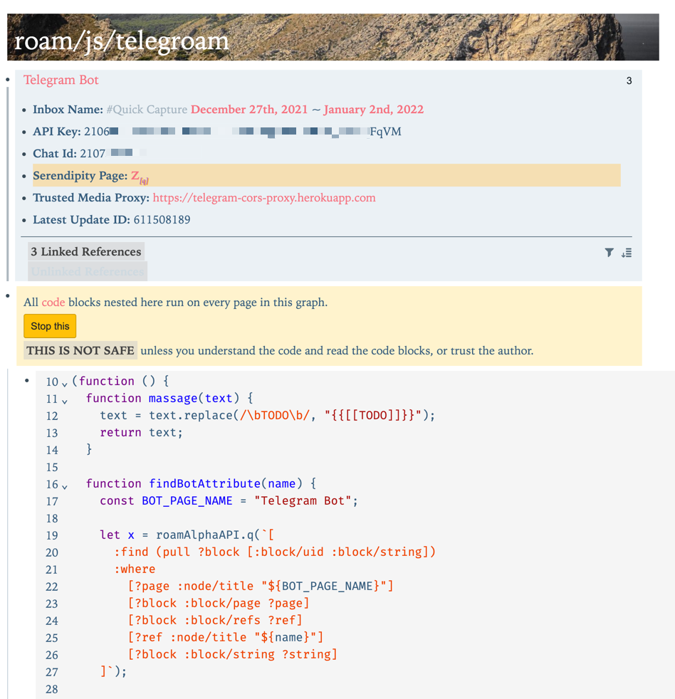
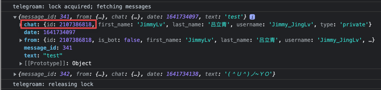

## Feature

When Roam Research receives one message, it automatically returns a previously random note:


## Installation

1. In Telegram, talk to [@BotFather](https://t.me/botfather) to create a new bot and get an API key for it.
2. Send something to your bot in a private message.
3. Make a page in your Roam called [[Telegram Bot]].
4. Paste these nodes somewhere on the [[Telegram Bot]] page:
```md
- Inbox Name:: [[Inbox]]
- API Key:: insert key you get from Telegram's bot system
  - {{[[TODO]]}} update the Telegram API key above
- Chat Id::
- Serendipity Page:: [[TODO]]
- Trusted Media Proxy:: https://wsrv.nl/?url=
- Latest Update ID::
```
5. Make a block with the text `{{[[roam/js]]}}`.
6. Add a nested **CHILD** block `/JavaScript Code Block` with this code...
```js
var existing = document.getElementById("telegroam");
if (!existing) {
  var extension = document.createElement("script");
  extension.src = "https://telegroam.vercel.app/main.js";
  extension.id = "telegroam";
  extension.async = true;
  extension.type = "text/javascript";
  document.getElementsByTagName("head")[0].appendChild(extension);
}
```
7. Press the BIG RED button to enable the script and refresh the page.



## Q&A

1. How to get your Telegram chat id? 

option 1: https://t.me/getmyid_bot

> This TG bot will send you your telegram user ID, current chat ID and sender ID or chat ID of forwarded message.


option 2: if you are FE dev, just open the Chrome DevTool, as you can see



2. How to select the block content that Bot is replying to?

Just change the `[[TODO]]` in `Serendipity Page:: [[TODO]]` to your own tag, such as `[[ZK]]` or `[[Zettel]]`
